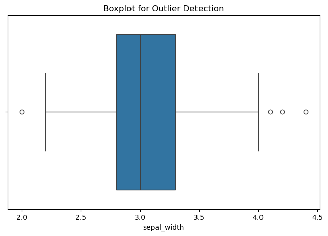

# Exno:1
Data Cleaning Process

# AIM
To read the given data and perform data cleaning and save the cleaned data to a file.

# Explanation
Data cleaning is the process of preparing data for analysis by removing or modifying data that is incorrect ,incompleted , irrelevant , duplicated or improperly formatted. Data cleaning is not simply about erasing data ,but rather finding a way to maximize datasets accuracy without necessarily deleting the information.

# Algorithm
STEP 1: Read the given Data

STEP 2: Get the information about the data

STEP 3: Remove the null values from the data

STEP 4: Save the Clean data to the file

STEP 5: Remove outliers using IQR

STEP 6: Use zscore of to remove outliers

# Coding and Output

```
import pandas as pd
from scipy import stats


df = pd.read_csv("iris.csv")


print("First 5 rows:")
print(df.head())

print("\nData info:")
print(df.info())

print("\nBasic statistics:")
print(df.describe())


df = df.dropna()


numeric_cols = df.select_dtypes(include=['float64', 'int64']).columns

Q1 = df[numeric_cols].quantile(0.25)
Q3 = df[numeric_cols].quantile(0.75)
IQR = Q3 - Q1

df_iqr = df[~((df[numeric_cols] < (Q1 - 1.5 * IQR)) | (df[numeric_cols] > (Q3 + 1.5 * IQR))).any(axis=1)]


z_scores = stats.zscore(df_iqr[numeric_cols])
abs_z_scores = abs(z_scores)
filtered_entries = (abs_z_scores < 3).all(axis=1)
df_zscore = df_iqr[filtered_entries]


df_zscore.to_csv("iris_cleaned.csv", index=False)
print("\nFinal cleaned dataset saved as 'iris_cleaned.csv'")

```
# Output
[text](ex1output.txt)

.png)
.png)


# Result

Thus the python program to read the given data and perform data cleaning and save the cleaned data to a file has been completed successfully.

